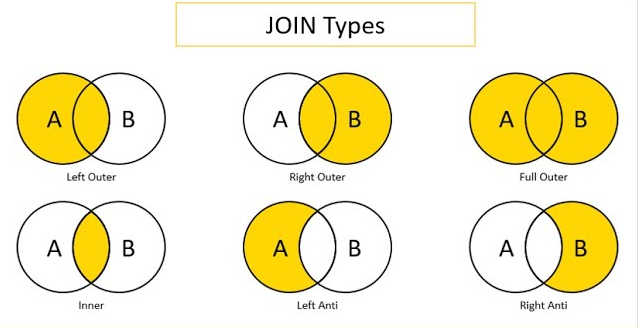

# Introducción a Apache Spark

## Apache Spark

Spark
es una solución Big Data de código abierto . Desarrollado por el laboratorio RAD de UC Berkeley (2009).

Se ha convertido en una herramienta de referencia en el campo del Big Data.


## Apache Spark vs Hadoop MapReduce

Más fácil y rápida que Hadoop MapReduce.
Diferencias:

- **Spark** mucho más rápido al almacenar en caché los datos en la **memoria** vs **MapReduce** en el **disco duro** (más lectura y escritura).
- Spark optimizado para un mejor **paralelismo**, uilización **CPU** e inicio más rápido.
- Spark tiene modelo de **programación funcional** más rico.
- Spark es especialmente útil para **algoritmos iterativos**.

## Cómo se ejecuta Spark en un clúster

Dos elementos diferenciados:

- El **controlador o driver**.
- Los **workers**: Cada uno tendrá sus procesos en ejecución y su disco asociado para guardar datos en memoria.

Cuando ejecutamos Spark, tenemos que inicializar la Spark Session, que está dentro del controlador.

Después, el **Resource Manager/Spark Master** asigna tareas a los workers (una tarea por partición).

Después, una tarea aplica su unidad de trabajo al conjunto de datos en su partición y genera un nuevo conjunto de datos de partición.

Finalmente, los resultados se envían de vuelta al controlador o se pueden almacenar en disco.

En resumen, lo que hace Spark es distribuir las tareas y repartirlas, y una vez que cada worker ha terminado su trabajo, unificar los resultados.


## Componentes de Spark

Spark tiene un **ecosistema** de herramientas **muy completo**.


- **Spark Core API**: Contiene la funcionalidad básica de Spark. También alberga la API que define los RDD (Conjuntos de datos distribuidos y resistentes).
- **Paquete Spark SQL & DataFrames**: Se utiliza para trabajar con datos estructurados, permite consultar datos a través de SQL y Apache Half. Admite también varias fuentes de datos como JSON o CSV.
- **Streaming**: Es el procesamiento de datos en tiempo real. Proporciona una API para manipular flujos de datos que son similares a la API de RDDs.
- **MLlib**: Proporciona varios tipos de algoritmos de aprendizaje automático (clasificación, regresión, agrupación en clústeres) y también las bibliotecas que hacen falta para pre procesar los datos y entrenar modelos de machine learning.
- **GraphX**: Biblioteca que se utiliza para manipular grafos y realizar cálculos en paralelo con grafos.

## PySpark

**PySpark** es una biblioteca Spark **escrita en Python** para ejecutar la aplicación Python usando las **capacidades de Apache Spark**. Esto implica, que nuestras aplicaciones se pueden ejecutar en un clúster distribuido en paralelo.

Ventajas de PySpark:

- **Fácil** de aprender
- Amplio conjunto de librerías para **ML y DS**
- Gran apoyo de la **comunidad**

## Arquitectura de PySpark

Apache Spark funciona en una **arquitectura maestro-esclavo**. Las **operaciones** se ejecutan en los **trabajadores (workers)**, y el **Cluster Manager** administra los recursos.


Cuando se ejecuta una aplicación de Spark, Spark Driver crea un contexto, que es un punto de entrada de la aplicación y todas las operaciones asociadas se ejecutan en los nodos de los workers.

Finalmente, el Cluster Manager administra estos recursos.

## Tipos de administradores de clústeres

Spark admite los siguientes administradores de clústeres:

- **Standalone**: administrador de clúster simple.
- **Apache Mesos**: es un administrador de clústeres que puede ejecutar también Hadoop MapReduce y PySpark.
- **Hadoop YARN**: el administrador de recursos en Hadoop 2
- **Kubernetes**: para automatizar la implementación y administración de aplicaciones en contenedores.

------

# RDDs de Apache Spark

## Apache Spark RDDs

Los RDD son los componentes básicos de cualquier aplicación Spark. RDD significa:

- **Resilente**: es tolerante a fallos y es capaz de reconstruir datos en caso de fallo.
- **Distribuido**: los datos se distribuyen entre los múltiples nodos de un clúster.
- **Conjunto de datos**: colección de datos particionados con valores.


Los RDDs son una capa de datos abstractos sobre la colección distribuida de datos (se divide un conjunto de datos en diferentes fragmentos). Además, los RDD son de naturaleza **inmutable** y también siguen transformaciones **perezosas** por lo que las transformaciones que se aplican sobre estos RDDs no se aplican hasta que se ejecuta una acción.

## Operaciones en RDDs


Con los RDD, puede realizar dos tipos de operaciones:

- **Transformaciones**: estas operaciones se aplican para crear un nuevo RDD. Cuando aplicamos una transformación a un RDD, no se evaluará de inmediato, sino que solo se almacenará en un DAG (Grafo Dirigido Acíclico) y después se evaluará cuando se ejecute una acción. Algunas transformaciones comunes son: map, filter, flatMap, groupBy o reduceByKey.

  - **parallelize(<collection>)**: crear un RDD de una colección.

    ```python
    num = [1,2,3,4,5]
    
    num_rdd = sc.parallelize(num)
    num_rdd.collect()
    ```

  - **map(<function>)**: mapeará su entrada a alguna salida basada en la función especificada.

    ```python
    double_rdd = num_rdd.map(lambda x : x * 2)
    double_rdd.collect()
    ```

    

  - **filter(<function>)**: filtrar los datos en función de una determinada condición.

    ```python
    even_rdd = num_rdd.filter(lambda x : x % 2 == 0)
    even_rdd.collect()
    ```

  - **flatMap(<function>)**: muy similar a map, pero puede devolver múltiples elementos para cada entrada en el RDD dado.

    ```python
    flat_rdd = num_rdd.flatMap(lambda x : range(1,x))
    flat_rdd.collect()
    ```

  - **distinct(<collection>)**: devolverá elementos distintos de un RDD.

    ```python
    rdd1 = sc.parallelize([10, 11, 10, 11, 12, 11])
    dist_rdd = rdd1.distinct()
    dist_rdd.collect()
    ```

  - **reduceByKey(<function>)**: reduce los pares de valores clave en función de las claves y una función determinada dentro de reduceByKey.

    ```python
    pairs = [ ("a", 5), ("b", 7), ("c", 2), ("a", 3), ("b", 1), ("c", 4)]
    pair_rdd = sc.parallelize(pairs)
    
    output = pair_rdd.reduceByKey(lambda x, y : x + y)
    
    result = output.collect()
    print(*result, sep='\n')
    ```

  - **groupByKey(<function>)**: es otra función ByKey que puede operar en un par (clave, valor) RDD pero esto solo agrupará los valores basados en las claves. En otras palabras, esto solo realizará el primer paso de reduceByKey.

    ```python
    grp_out = pair_rdd.groupByKey()
    grp_out.collect()
    
    # Out
    [('a', <pyspark.resultiterable.ResultIterable at 0x1cc3ebdd2e0>),
     ('b', <pyspark.resultiterable.ResultIterable at 0x1cc2e1d5100>),
     ('c', <pyspark.resultiterable.ResultIterable at 0x1cc2f007e50>)]
    ```

  - **sortByKey(<function>)**: realizará la clasificación en un par (clave, valor) RDD basado en las claves. De forma predeterminada, la clasificación se realizará en orden ascendente.

    ```python
    pairs = [ ("a", 5), ("d", 7), ("c", 2), ("b", 3)]
    raw_rdd = sc.parallelize(pairs)
    
    sortkey_rdd = raw_rdd.sortByKey()
    result = sortkey_rdd.collect()
    print(*result,sep='\n')
    
    # Para clasificar en orden descendente, pase  “ascending=False”.
    
    # Out
    ('a', 5)
    ('b', 3)
    ('c', 2)
    ('d', 7)
    ```

  - **sortBy(<function>)**: es una función más generalizada para ordenar.

    ```python
    # Create RDD.
    pairs = [ ("a", 5, 10), ("d", 7, 12), ("c", 2, 11), ("b", 3, 9)]
    raw_rdd = sc.parallelize(pairs)
    
    # Let’s try to do the sorting based on the 3rd element of the tuple.
    sort_out = raw_rdd.sortBy(lambda x : x[2])
    result = sort_out.collect()
    print(*result, sep='\n')
    
    # Out
    ('b', 3, 9)
    ('a', 5, 10)
    ('c', 2, 11)
    ('d', 7, 12)
    ```

- **Acciones**: estas operaciones se aplican de forma **inmediata** en un RDD para indicarle a Apache Spark que aplique el cálculo y devuelva el resultado al controlador. Algunas acciones comunes son:

  - **count**: contará el número de elementos en el RDD dado.

    ```python
    num = sc.parallelize([1,2,3,4,2])
    num.count()
    
    # Out
    5
    ```

  - **first**: devolverá el primer elemento del RDD dado.

    ```python
    num.first()
    
    # Out
    1
    ```

  - **collect**: devolverá todos los elementos para el RDD dado. **No debemos utiliza la operación de collect mientras trabajamos con grandes conjuntos de datos**. Porque devolverá todos los datos que se distribuyen entre los diferentes workers del clúster a un controlador. Todos los datos viajarán a través de la red del worker al conductor y también el conductor necesitaría almacenar todos los datos. Esto obstaculizará el rendimiento de su aplicación.

    ```python
    num.collect()
    
    # Out
    [1, 2, 3, 4, 2]
    ```

  - **take**: devolverá el número de elementos especificados.

    ```python
    num.take(3)
    
    # Out
    num.take(3)
    ```

  - **countByValue**: cuenta la cantidad de veces que aparece cada valor en un RDD.
  
    ```python
    data = ['Python', 'Scala', 'Python', 'R', 'Python', 'Java', 'R']
    
    myRDD = sc.parallelize(data)
    
    ## Cuenta cuantas veces aparece cada valor
    output = myRDD.countByValue()
    
    # Out
    defaultdict(<class 'int'>, {'Python': 3, 'Scala': 1, 'R': 2, 'Java': 1})
    ```
  
  - **countByKey**: cuenta el número de ocurrencias para cada clave en un RDD compuesto por pares clave-valor.
  
    ```python
    data = [('a', 1), ('b', 1), ('c', 1), ('a', 1)]
    myRDD = sc.parallelize(data)
    
    ## Cuenta cuantas veces aparece cada una de las keys
    output = myRDD.countByKey()
    
    # Out
    defaultdict(<class 'int'>, {'a': 2, 'b': 1, 'c': 1})
    ```

------

# DataFrames en Apacha Spark

## Introducción a DataFrames

Los **DataFrames** son de naturaleza **tabular** (formato tabla). Las filas permiten varios formatos dentro de una misma tabla (**heterogéneos**), mientras que cada columna suele tener valores con un único formato (**homogéneos**). Similares a las tablas SQL o a las hojas de cálculo.

Los DataFrames suelen contener algunos metadatos además de los datos (nombres de las columnas, índices de las filas, etc).


## Ventajas de los DataFrames

Algunas de las ventajas de trabajar con Dataframes en Spark son:

- Capacidad de procesar una **gran cantidad de datos** (hasta Petabytes de datos) estructurados o semiestructurados
- Fácil **manejo de datos** e imputación de valores faltantes
- Múltiples formatos como **fuentes de datos**
- Compatibilidad con **múltiples lenguajes**


## Características de los DataFrames

Los **DataFrames** de Spark **se caracterizan** por: ser distribuidos, evaluación perezosa, inmutabilidad y tolerancia a fallos.


## Fuentes de datos de DataFrames

Los marcos de datos en PySpark se pueden crear de varias formas: a través de archivos, utilizando RDDs o a través de bases de datos.


## Fundamentos de Apache Spark: SQL/DataFrames

**Spark trabaja con DataFrames**. Un DataFrame es una **representación relacional de los datos**. Proporciona funciones con capacidades similares a SQL. Además, permite escribir **consultas tipo SQL** para nuestro análisis de datos.

Los DataFrames son similares a las tablas relacionales o DataFrames en Python / R aunque con muchas optimizaciones que se ejecutan de manera "oculta" para el usuario. Hay varias formas de crear DataFrames a partir de colecciones, tablas HIVE, tablas relacionales y RDD.

- **createDataFrame**: para crear un DataFrame.

  ```python
  mp = [(1, "AAA", "dept1", 1000),
      (2, "BBB", "dept1", 1100),
      (3, "CCC", "dept1", 3000),
      (4, "DDD", "dept1", 1500),
      (5, "EEE", "dept2", 8000),
      (6, "FFF", "dept2", 7200),
      (7, "GGG", "dept3", 7100),
      (8, "HHH", "dept3", 3700),
      (9, "III", "dept3", 4500),
      (10, "JJJ", "dept5", 3400)]
  
  dept = [("dept1", "Department - 1"),
          ("dept2", "Department - 2"),
          ("dept3", "Department - 3"),
          ("dept4", "Department - 4")
  
         ]
  
  df = spark.createDataFrame(emp, ["id", "name", "dept", "salary"])
  
  deptdf = spark.createDataFrame(dept, ["id", "name"]) 
  
  df.show()
  ```

## Operaciones básicas en DataFrames

- **count**: Cuenta el número de filas:

  ```python
  df.count()
  
  # Out
  10
  ```

- **columns**: para obtener una lista de nombres de columnas de ese DataFrame.

  ```python
  df.columns
  
  # Out
  ['id', 'name', 'dept', 'salary']
  ```

- **dtypes**: Accede al datatype de columnas dentro del DataFrame.

  ```python
  df.dtypes
  
  # Out
  [('id', 'bigint'),
   ('name', 'string'),
   ('dept', 'string'),
   ('salary', 'bigint')]
  ```

- **schema**: Comprueba cómo Spark almacena el esquema del DataFrame

  ```python
  df.schema
  
  # Out
  StructType(List(StructField(id,LongType,true),StructField(name,StringType,true),StructField(dept,StringType,true),StructField(salary,LongType,true)))
  ```

- **printSchema**: para imprimir el esquema del DataFrame en la consola de salida.

  ```python
  df.printSchema()
  
  # Out
  root
   |-- id: long (nullable = true)
   |-- name: string (nullable = true)
   |-- dept: string (nullable = true)
   |-- salary: long (nullable = true)
  ```

- **select**: Selecciona columnas del DataFrame.

  ```python
  df.select("id", "name").show()
  
  # Out
  +---+----+
  | id|name|
  +---+----+
  |  1| AAA|
  |  2| BBB|
  |  3| CCC|
  |  4| DDD|
  |  5| EEE|
  |  6| FFF|
  |  7| GGG|
  |  8| HHH|
  |  9| III|
  | 10| JJJ|
  +---+----+
  ```

- **filter**: Filtrar las filas según alguna condición (por ejemplo, intentemos encontrar las filas con id = 1). Hay diferentes formas de especificar la condición.

  ```python
  df.filter(df["id"] == 1).show()
  df.filter(df.id == 1).show()
  # Or
  df.filter(col("id") == 1).show()
  df.filter("id = 1").show()
  
  # Out
  +---+----+-----+------+
  | id|name| dept|salary|
  +---+----+-----+------+
  |  1| AAA|dept1|  1000|
  +---+----+-----+------+
  
  +---+----+-----+------+
  | id|name| dept|salary|
  +---+----+-----+------+
  |  1| AAA|dept1|  1000|
  +---+----+-----+------+
  ```

- **drop**: Elimina una columna en particular (al ser los DataFrames de naturaleza inmutable, no elimina la columna del DF, si no que devuelve una copia del DF original sin esa columna).

  ```python
  newdf = df.drop("id")
  newdf.show(2)
  
  # Out
  +----+-----+------+
  |name| dept|salary|
  +----+-----+------+
  | AAA|dept1|  1000|
  | BBB|dept1|  1100|
  +----+-----+------+
  only showing top 2 rows
  ```

- **describe**: proporciona un resumen estadístico de las columnas numéricas del DataFrame, incluyendo el número de elementos, la media, la desviación estándar, el valor mínimo, el valor máximo y algunos percentiles.

  ```python
  # df
  +----+---+------+
  |  id|age|salary|
  +----+---+------+
  |   1| 25|  3500|
  |   2| 30|  5000|
  |   3| 40|  8000|
  |   4| 35|  6000|
  |   5| 28|  4000|
  +----+---+------+
  
  # Code
  df.describe().show()
  
  # Out
  +-------+------------------+------------------+------------------+
  |summary|                id|               age|            salary|
  +-------+------------------+------------------+------------------+
  |  count|                 5|                 5|                 5|
  |   mean|               3.0|              31.6|             5300.0|
  | stddev|1.5811388300841898|6.7955467275733065|1870.8286933869706|
  |    min|                 1|                25|              3500|
  |    max|                 5|                40|              8000|
  +-------+------------------+------------------+------------------+
  ```

  

## Aggregations

Podemos usar la función **groupBy** para agrupar los datos y luego usar la función "**agg**" para realizar la agregación de datos agrupados.

```python
(df.groupBy("dept")
    .agg(
        count("salary").alias("count"),
        sum("salary").alias("sum"),
        max("salary").alias("max"),
        min("salary").alias("min"),
        avg("salary").alias("avg")
        ).show()
)

# Out
+-----+-----+-----+----+----+------+
| dept|count|  sum| max| min|   avg|
+-----+-----+-----+----+----+------+
|dept5|    1| 3400|3400|3400|3400.0|
|dept3|    3|15300|7100|3700|5100.0|
|dept1|    4| 6600|3000|1000|1650.0|
|dept2|    2|15200|8000|7200|7600.0|
+-----+-----+-----+----+----+------+
```

## Sorting

Ordena los datos según el "salario". De forma predeterminada, la clasificación se realizará en orden ascendente.

```python
df.sort("salary").show(5)

# Out
+---+----+-----+------+
| id|name| dept|salary|
+---+----+-----+------+
|  1| AAA|dept1|  1000|
|  2| BBB|dept1|  1100|
|  4| DDD|dept1|  1500|
|  3| CCC|dept1|  3000|
| 10| JJJ|dept5|  3400|
+---+----+-----+------+
only showing top 5 rows
```

```python
# Sort the data in descending order.
df.sort(desc("salary")).show(5)

# Out
+---+----+-----+------+
| id|name| dept|salary|
+---+----+-----+------+
|  5| EEE|dept2|  8000|
|  6| FFF|dept2|  7200|
|  7| GGG|dept3|  7100|
|  9| III|dept3|  4500|
|  8| HHH|dept3|  3700|
+---+----+-----+------+
only showing top 5 rows
```

## Columnas derivadas

Podemos usar la función "withColumn" para derivar la columna en función de las columnas existentes...

```python
df.withColumn("bonus", col("salary") * .1).show()

# Out
+---+----+-----+------+-----+
| id|name| dept|salary|bonus|
+---+----+-----+------+-----+
|  1| AAA|dept1|  1000|100.0|
|  2| BBB|dept1|  1100|110.0|
|  3| CCC|dept1|  3000|300.0|
|  4| DDD|dept1|  1500|150.0|
|  5| EEE|dept2|  8000|800.0|
|  6| FFF|dept2|  7200|720.0|
|  7| GGG|dept3|  7100|710.0|
|  8| HHH|dept3|  3700|370.0|
|  9| III|dept3|  4500|450.0|
| 10| JJJ|dept5|  3400|340.0|
+---+----+-----+------+-----+
```

## Joins



1. Left Outer Join (o Left Join): Devuelve todas las filas de la tabla de la izquierda (primera tabla especificada) y las filas coincidentes de la tabla de la derecha (segunda tabla especificada), y nulos en las filas donde no hay coincidencias en la tabla de la derecha.

Por ejemplo:

```sql
sqlCopy codeSELECT *
FROM tablaA
LEFT JOIN tablaB
ON tablaA.id = tablaB.id;
```

2. Right Outer Join (o Right Join): Devuelve todas las filas de la tabla de la derecha (segunda tabla especificada) y las filas coincidentes de la tabla de la izquierda (primera tabla especificada), y nulos en las filas donde no hay coincidencias en la tabla de la izquierda.

Por ejemplo:

```sql
sqlCopy codeSELECT *
FROM tablaA
RIGHT JOIN tablaB
ON tablaA.id = tablaB.id;
```

3. Full Outer Join (o Full Join): Devuelve todas las filas de ambas tablas, y nulos en las filas donde no hay coincidencias.

Por ejemplo:

```sql
sqlCopy codeSELECT *
FROM tablaA
FULL OUTER JOIN tablaB
ON tablaA.id = tablaB.id;
```

4. Inner Join: Devuelve sólo las filas que tienen coincidencias en ambas tablas, eliminando cualquier fila que no tenga coincidencia.

Por ejemplo:

```sql
sqlCopy codeSELECT *
FROM tablaA
INNER JOIN tablaB
ON tablaA.id = tablaB.id;
```

5. Left Anti Join: Devuelve todas las filas de la tabla de la izquierda que no tienen coincidencias en la tabla de la derecha.

Por ejemplo:

```sql
sqlCopy codeSELECT *
FROM tablaA
LEFT ANTI JOIN tablaB
ON tablaA.id = tablaB.id;
```

6. Right Anti Join: Devuelve todas las filas de la tabla de la derecha que no tienen coincidencias en la tabla de la izquierda.

Por ejemplo:

```sql
sqlCopy codeSELECT *
FROM tablaA
RIGHT ANTI JOIN tablaB
ON tablaA.id = tablaB.id;
```

En PySpark, estas operaciones de join se realizan de manera similar a SQL, pero utilizando las funciones `join` o `joinWith` en los objetos `DataFrame`. La sintaxis sería similar a la que se muestra en los ejemplos anteriores, pero utilizando las funciones mencionadas y especificando los nombres de las columnas que se utilizan para unir las tablas.

Podemos realizar varios tipos de combinaciones en múltiples DataFrames.

```python
# Inner JOIN.
df.join(deptdf, df["dept"] == deptdf["id"]).show()

# Out
+---+----+-----+------+-----+--------------+
| id|name| dept|salary|   id|          name|
+---+----+-----+------+-----+--------------+
|  7| GGG|dept3|  7100|dept3|Department - 3|
|  8| HHH|dept3|  3700|dept3|Department - 3|
|  9| III|dept3|  4500|dept3|Department - 3|
|  1| AAA|dept1|  1000|dept1|Department - 1|
|  2| BBB|dept1|  1100|dept1|Department - 1|
|  3| CCC|dept1|  3000|dept1|Department - 1|
|  4| DDD|dept1|  1500|dept1|Department - 1|
|  5| EEE|dept2|  8000|dept2|Department - 2|
|  6| FFF|dept2|  7200|dept2|Department - 2|
+---+----+-----+------+-----+--------------+
```

## Left Outer Join

```python
df.join(deptdf, df["dept"] == deptdf["id"], "left_outer").show()

# Out
+---+----+-----+------+-----+--------------+
| id|name| dept|salary|   id|          name|
+---+----+-----+------+-----+--------------+
| 10| JJJ|dept5|  3400| null|          null|
|  7| GGG|dept3|  7100|dept3|Department - 3|
|  8| HHH|dept3|  3700|dept3|Department - 3|
|  9| III|dept3|  4500|dept3|Department - 3|
|  1| AAA|dept1|  1000|dept1|Department - 1|
|  2| BBB|dept1|  1100|dept1|Department - 1|
|  3| CCC|dept1|  3000|dept1|Department - 1|
|  4| DDD|dept1|  1500|dept1|Department - 1|
|  5| EEE|dept2|  8000|dept2|Department - 2|
|  6| FFF|dept2|  7200|dept2|Department - 2|
+---+----+-----+------+-----+--------------+
```

## Right Outer Join

```python
df.join(deptdf, df["dept"] == deptdf["id"], "right_outer").show()

# Out
+----+----+-----+------+-----+--------------+
|  id|name| dept|salary|   id|          name|
+----+----+-----+------+-----+--------------+
|   7| GGG|dept3|  7100|dept3|Department - 3|
|   8| HHH|dept3|  3700|dept3|Department - 3|
|   9| III|dept3|  4500|dept3|Department - 3|
|   1| AAA|dept1|  1000|dept1|Department - 1|
|   2| BBB|dept1|  1100|dept1|Department - 1|
|   3| CCC|dept1|  3000|dept1|Department - 1|
|   4| DDD|dept1|  1500|dept1|Department - 1|
|null|null| null|  null|dept4|Department - 4|
|   5| EEE|dept2|  8000|dept2|Department - 2|
|   6| FFF|dept2|  7200|dept2|Department - 2|
+----+----+-----+------+-----+--------------+
```

## Full Outer Join

```python
df.join(deptdf, df["dept"] == deptdf["id"], "outer").show()

# Out
+----+----+-----+------+-----+--------------+
|  id|name| dept|salary|   id|          name|
+----+----+-----+------+-----+--------------+
|  10| JJJ|dept5|  3400| null|          null|
|   7| GGG|dept3|  7100|dept3|Department - 3|
|   8| HHH|dept3|  3700|dept3|Department - 3|
|   9| III|dept3|  4500|dept3|Department - 3|
|   1| AAA|dept1|  1000|dept1|Department - 1|
|   2| BBB|dept1|  1100|dept1|Department - 1|
|   3| CCC|dept1|  3000|dept1|Department - 1|
|   4| DDD|dept1|  1500|dept1|Department - 1|
|null|null| null|  null|dept4|Department - 4|
|   5| EEE|dept2|  8000|dept2|Department - 2|
|   6| FFF|dept2|  7200|dept2|Department - 2|
+----+----+-----+------+-----+--------------+
```

## Consultas SQL

Ejecución de consultas tipo SQL. También podemos realizar análisis de datos escribiendo consultas similares a SQL. Para realizar consultas similares a SQL, necesitamos registrar el DataFrame como una Vista temporal.

```python
# Register DataFrame as Temporary Table
df.createOrReplaceTempView("temp_table")

# Execute SQL-Like query.
spark.sql("select * from temp_table where id = 1").show()

# Out
+---+----+-----+------+
| id|name| dept|salary|
+---+----+-----+------+
|  1| AAA|dept1|  1000|
+---+----+-----+------+
```

```python
spark.sql("select distinct id from temp_table").show(10)

# Out
+---+
| id|
+---+
|  7|
|  6|
|  9|
|  5|
|  1|
| 10|
|  3|
|  8|
|  2|
|  4|
+---+
```

```python
spark.sql("select * from temp_table where salary >= 1500").show(10)

# Out
+---+----+-----+------+
| id|name| dept|salary|
+---+----+-----+------+
|  3| CCC|dept1|  3000|
|  4| DDD|dept1|  1500|
|  5| EEE|dept2|  8000|
|  6| FFF|dept2|  7200|
|  7| GGG|dept3|  7100|
|  8| HHH|dept3|  3700|
|  9| III|dept3|  4500|
| 10| JJJ|dept5|  3400|
+---+----+-----+------+
```

## Guardar DataFrame como tabla HIVE

```python
df.write.saveAsTable("DB_NAME.TBL_NAME")

## También podemos seleccionar el argumento "modo" con overwrite", "append", "error" etc.
df.write.saveAsTable("DB_NAME.TBL_NAME", mode="overwrite")

# De forma predeterminada, la operación guardará el DataFrame como una tabla interna / administrada de HIVE
```

## Guardar el DataFrame como una tabla externa HIVE

```python
df.write.saveAsTable("DB_NAME.TBL_NAME", path=<location_of_external_table>)
```

## Leyendo la tabla HIVE como DataFrame

```python
# DB_NAME : Name of the the HIVE Database
# TBL_NAME : Name of the HIVE Table

df = spark.table("DB_NAME.TBL_NAME")
```

## Crear un DataFrame a partir de un archivo CSV

Podemos crear un DataFrame usando un archivo CDV y podemos especificar varias opciones como un separador, encabezado, esquema, inferSchema y varias otras opciones.

```python
df = spark.read.csv("path_to_csv_file", sep="|", header=True, inferSchema=True)
```

## Guardar un DataFrame como un archivo CSV

```python
df.write.csv("path_to_CSV_File", sep="|", header=True, mode="overwrite")
```

## Crea un DataFrame a partir de una tabla relacional

Podemos leer los datos de bases de datos relacionales usando una URL JDBC.

```python
# url : a JDBC URL of the form jdbc:subprotocol:subname
# TBL_NAME : Name of the relational table.
# USER_NAME : user name to connect to DataBase.
# PASSWORD: password to connect to DataBase.


relational_df = spark.read.format('jdbc')\
                    .options(url="url", dbtable="TBL_NAME", user="USER_NAME", password="PASSWORD")\
    .load()
```

## Guardar el DataFrame como una tabla relacional

Podemos guardar el DataFrame como una tabla relacional usando una URL JDBC.

```python
# url : a JDBC URL of the form jdbc:subprotocol:subname
# TBL_NAME : Name of the relational table.
# USER_NAME : user name to connect to DataBase.
# PASSWORD: password to connect to DataBase.


relational_df.write.format('jdbc')\
                    .options(url="url", dbtable="TBL_NAME", user="USER_NAME", password="PASSWORD")\
                    .mode('overwrite')\
                    .save()
```

------

# Funciones avanzadas de Spark


