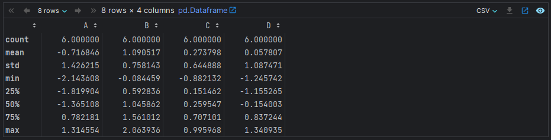

# Introducción a Apache Spark

## Apache Spark

Spark
es una solución Big Data de código abierto . Desarrollado por el laboratorio RAD de UC Berkeley (2009).

Se ha convertido en una herramienta de referencia en el campo del Big Data.


## Apache Spark vs Hadoop MapReduce

Más fácil y rápida que Hadoop MapReduce.
Diferencias:

- **Spark** mucho más rápido al almacenar en caché los datos en la **memoria** vs **MapReduce** en el **disco duro** (más lectura y escritura).
- Spark optimizado para un mejor **paralelismo**, uilización **CPU** e inicio más rápido.
- Spark tiene modelo de **programación funcional** más rico.
- Spark es especialmente útil para **algoritmos iterativos**.

## Cómo se ejecuta Spark en un clúster

Dos elementos diferenciados:

- El **controlador o driver**.
- Los **workers**: Cada uno tendrá sus procesos en ejecución y su disco asociado para guardar datos en memoria.

Cuando ejecutamos Spark, tenemos que inicializar la Spark Session, que está dentro del controlador.

Después, el **Resource Manager/Spark Master** asigna tareas a los workers (una tarea por partición).

Después, una tarea aplica su unidad de trabajo al conjunto de datos en su partición y genera un nuevo conjunto de datos de partición.

Finalmente, los resultados se envían de vuelta al controlador o se pueden almacenar en disco.

En resumen, lo que hace Spark es distribuir las tareas y repartirlas, y una vez que cada worker ha terminado su trabajo, unificar los resultados.


## Componentes de Spark

Spark tiene un **ecosistema** de herramientas **muy completo**.


- **Spark Core API**: Contiene la funcionalidad básica de Spark. También alberga la API que define los RDD (Conjuntos de datos distribuidos y resistentes).
- **Paquete Spark SQL & DataFrames**: Se utiliza para trabajar con datos estructurados, permite consultar datos a través de SQL y Apache Half. Admite también varias fuentes de datos como JSON o CSV.
- **Streaming**: Es el procesamiento de datos en tiempo real. Proporciona una API para manipular flujos de datos que son similares a la API de RDDs.
- **MLlib**: Proporciona varios tipos de algoritmos de aprendizaje automático (clasificación, regresión, agrupación en clústeres) y también las bibliotecas que hacen falta para pre procesar los datos y entrenar modelos de machine learning.
- **GraphX**: Biblioteca que se utiliza para manipular grafos y realizar cálculos en paralelo con grafos.

## PySpark

**PySpark** es una biblioteca Spark **escrita en Python** para ejecutar la aplicación Python usando las **capacidades de Apache Spark**. Esto implica, que nuestras aplicaciones se pueden ejecutar en un clúster distribuido en paralelo.

Ventajas de PySpark:

- **Fácil** de aprender
- Amplio conjunto de librerías para **ML y DS**
- Gran apoyo de la **comunidad**

## Arquitectura de PySpark

Apache Spark funciona en una **arquitectura maestro-esclavo**. Las **operaciones** se ejecutan en los **trabajadores (workers)**, y el **Cluster Manager** administra los recursos.


Cuando se ejecuta una aplicación de Spark, Spark Driver crea un contexto, que es un punto de entrada de la aplicación y todas las operaciones asociadas se ejecutan en los nodos de los workers.

Finalmente, el Cluster Manager administra estos recursos.

## Tipos de administradores de clústeres

Spark admite los siguientes administradores de clústeres:

- **Standalone**: administrador de clúster simple.
- **Apache Mesos**: es un administrador de clústeres que puede ejecutar también Hadoop MapReduce y PySpark.
- **Hadoop YARN**: el administrador de recursos en Hadoop 2
- **Kubernetes**: para automatizar la implementación y administración de aplicaciones en contenedores.

------

# RDDs de Apache Spark

## Apache Spark RDDs

Los RDD son los componentes básicos de cualquier aplicación Spark. RDD significa:

- **Resilente**: es tolerante a fallos y es capaz de reconstruir datos en caso de fallo.
- **Distribuido**: los datos se distribuyen entre los múltiples nodos de un clúster.
- **Conjunto de datos**: colección de datos particionados con valores.


Los RDDs son una capa de datos abstractos sobre la colección distribuida de datos (se divide un conjunto de datos en diferentes fragmentos). Además, los RDD son de naturaleza **inmutable** y también siguen transformaciones **perezosas** por lo que las transformaciones que se aplican sobre estos RDDs no se aplican hasta que se ejecuta una acción.

## Operaciones en RDDs


Con los RDD, puede realizar dos tipos de operaciones:

- **Transformaciones**: estas operaciones se aplican para crear un nuevo RDD. Cuando aplicamos una transformación a un RDD, no se evaluará de inmediato, sino que solo se almacenará en un DAG (Grafo Dirigido Acíclico) y después se evaluará cuando se ejecute una acción. Algunas transformaciones comunes son: map, filter, flatMap, groupBy o reduceByKey.

  - **parallelize(<collection>)**: crear un RDD de una colección.

    ```python
    num = [1,2,3,4,5]
    
    num_rdd = sc.parallelize(num)
    num_rdd.collect()
    ```

  - **map(<function>)**: mapeará su entrada a alguna salida basada en la función especificada.

    ```python
    double_rdd = num_rdd.map(lambda x : x * 2)
    double_rdd.collect()
    ```

    

  - **filter(<function>)**: filtrar los datos en función de una determinada condición.

    ```python
    even_rdd = num_rdd.filter(lambda x : x % 2 == 0)
    even_rdd.collect()
    ```

  - **flatMap(<function>)**: muy similar a map, pero puede devolver múltiples elementos para cada entrada en el RDD dado.

    ```python
    flat_rdd = num_rdd.flatMap(lambda x : range(1,x))
    flat_rdd.collect()
    ```

  - **distinct(<collection>)**: devolverá elementos distintos de un RDD.

    ```python
    rdd1 = sc.parallelize([10, 11, 10, 11, 12, 11])
    dist_rdd = rdd1.distinct()
    dist_rdd.collect()
    ```

  - **reduceByKey(<function>)**: reduce los pares de valores clave en función de las claves y una función determinada dentro de reduceByKey.

    ```python
    pairs = [ ("a", 5), ("b", 7), ("c", 2), ("a", 3), ("b", 1), ("c", 4)]
    pair_rdd = sc.parallelize(pairs)
    
    output = pair_rdd.reduceByKey(lambda x, y : x + y)
    
    result = output.collect()
    print(*result, sep='\n')
    ```

  - **groupByKey(<function>)**: es otra función ByKey que puede operar en un par (clave, valor) RDD pero esto solo agrupará los valores basados en las claves. En otras palabras, esto solo realizará el primer paso de reduceByKey.

    ```python
    grp_out = pair_rdd.groupByKey()
    grp_out.collect()
    
    # Out
    [('a', <pyspark.resultiterable.ResultIterable at 0x1cc3ebdd2e0>),
     ('b', <pyspark.resultiterable.ResultIterable at 0x1cc2e1d5100>),
     ('c', <pyspark.resultiterable.ResultIterable at 0x1cc2f007e50>)]
    ```

  - **sortByKey(<function>)**: realizará la clasificación en un par (clave, valor) RDD basado en las claves. De forma predeterminada, la clasificación se realizará en orden ascendente.

    ```python
    pairs = [ ("a", 5), ("d", 7), ("c", 2), ("b", 3)]
    raw_rdd = sc.parallelize(pairs)
    
    sortkey_rdd = raw_rdd.sortByKey()
    result = sortkey_rdd.collect()
    print(*result,sep='\n')
    
    # Para clasificar en orden descendente, pase  “ascending=False”.
    
    # Out
    ('a', 5)
    ('b', 3)
    ('c', 2)
    ('d', 7)
    ```

  - **sortBy(<function>)**: es una función más generalizada para ordenar.

    ```python
    # Create RDD.
    pairs = [ ("a", 5, 10), ("d", 7, 12), ("c", 2, 11), ("b", 3, 9)]
    raw_rdd = sc.parallelize(pairs)
    
    # Let’s try to do the sorting based on the 3rd element of the tuple.
    sort_out = raw_rdd.sortBy(lambda x : x[2])
    result = sort_out.collect()
    print(*result, sep='\n')
    
    # Out
    ('b', 3, 9)
    ('a', 5, 10)
    ('c', 2, 11)
    ('d', 7, 12)
    ```

- **Acciones**: estas operaciones se aplican de forma **inmediata** en un RDD para indicarle a Apache Spark que aplique el cálculo y devuelva el resultado al controlador. Algunas acciones comunes son:

  - **count**: contará el número de elementos en el RDD dado.

    ```python
    num = sc.parallelize([1,2,3,4,2])
    num.count()
    
    # Out
    5
    ```

  - **first**: devolverá el primer elemento del RDD dado.

    ```python
    num.first()
    
    # Out
    1
    ```

  - **collect**: devolverá todos los elementos para el RDD dado. **No debemos utiliza la operación de collect mientras trabajamos con grandes conjuntos de datos**. Porque devolverá todos los datos que se distribuyen entre los diferentes workers del clúster a un controlador. Todos los datos viajarán a través de la red del worker al conductor y también el conductor necesitaría almacenar todos los datos. Esto obstaculizará el rendimiento de su aplicación.

    ```python
    num.collect()
    
    # Out
    [1, 2, 3, 4, 2]
    ```

  - **take**: devolverá el número de elementos especificados.

    ```python
    num.take(3)
    
    # Out
    num.take(3)
    ```

  - **countByValue**: cuenta la cantidad de veces que aparece cada valor en un RDD.
  
    ```python
    data = ['Python', 'Scala', 'Python', 'R', 'Python', 'Java', 'R']
    
    myRDD = sc.parallelize(data)
    
    ## Cuenta cuantas veces aparece cada valor
    output = myRDD.countByValue()
    
    # Out
    defaultdict(<class 'int'>, {'Python': 3, 'Scala': 1, 'R': 2, 'Java': 1})
    ```
  
  - **countByKey**: cuenta el número de ocurrencias para cada clave en un RDD compuesto por pares clave-valor.
  
    ```python
    data = [('a', 1), ('b', 1), ('c', 1), ('a', 1)]
    myRDD = sc.parallelize(data)
    
    ## Cuenta cuantas veces aparece cada una de las keys
    output = myRDD.countByKey()
    
    # Out
    defaultdict(<class 'int'>, {'a': 2, 'b': 1, 'c': 1})
    ```

------

# DataFrames en Apacha Spark

## Introducción a DataFrames

Los **DataFrames** son de naturaleza **tabular** (formato tabla). Las filas permiten varios formatos dentro de una misma tabla (**heterogéneos**), mientras que cada columna suele tener valores con un único formato (**homogéneos**). Similares a las tablas SQL o a las hojas de cálculo.

Los DataFrames suelen contener algunos metadatos además de los datos (nombres de las columnas, índices de las filas, etc).


## Ventajas de los DataFrames

Algunas de las ventajas de trabajar con Dataframes en Spark son:

- Capacidad de procesar una **gran cantidad de datos** (hasta Petabytes de datos) estructurados o semiestructurados
- Fácil **manejo de datos** e imputación de valores faltantes
- Múltiples formatos como **fuentes de datos**
- Compatibilidad con **múltiples lenguajes**


## Características de los DataFrames

Los **DataFrames** de Spark **se caracterizan** por: ser distribuidos, evaluación perezosa, inmutabilidad y tolerancia a fallos.


## Fuentes de datos de DataFrames

Los marcos de datos en PySpark se pueden crear de varias formas: a través de archivos, utilizando RDDs o a través de bases de datos.


## Fundamentos de Apache Spark: SQL/DataFrames

**Spark trabaja con DataFrames**. Un DataFrame es una **representación relacional de los datos**. Proporciona funciones con capacidades similares a SQL. Además, permite escribir **consultas tipo SQL** para nuestro análisis de datos.

Los DataFrames son similares a las tablas relacionales o DataFrames en Python / R aunque con muchas optimizaciones que se ejecutan de manera "oculta" para el usuario. Hay varias formas de crear DataFrames a partir de colecciones, tablas HIVE, tablas relacionales y RDD.

- **createDataFrame**: para crear un DataFrame.

  ```python
  mp = [(1, "AAA", "dept1", 1000),
      (2, "BBB", "dept1", 1100),
      (3, "CCC", "dept1", 3000),
      (4, "DDD", "dept1", 1500),
      (5, "EEE", "dept2", 8000),
      (6, "FFF", "dept2", 7200),
      (7, "GGG", "dept3", 7100),
      (8, "HHH", "dept3", 3700),
      (9, "III", "dept3", 4500),
      (10, "JJJ", "dept5", 3400)]
  
  dept = [("dept1", "Department - 1"),
          ("dept2", "Department - 2"),
          ("dept3", "Department - 3"),
          ("dept4", "Department - 4")
  
         ]
  
  df = spark.createDataFrame(emp, ["id", "name", "dept", "salary"])
  
  deptdf = spark.createDataFrame(dept, ["id", "name"]) 
  
  df.show()
  ```

## Operaciones básicas en DataFrames

- **count**: Cuenta el número de filas:

  ```python
  df.count()
  
  # Out
  10
  ```

- **columns**: para obtener una lista de nombres de columnas de ese DataFrame.

  ```python
  df.columns
  
  # Out
  ['id', 'name', 'dept', 'salary']
  ```

- **1s**: Accede al datatype de columnas dentro del DataFrame.

  ```python
  df.dtypes
  
  # Out
  [('id', 'bigint'),
   ('name', 'string'),
   ('dept', 'string'),
   ('salary', 'bigint')]
  ```

- **schema**: Comprueba cómo Spark almacena el esquema del DataFrame

  ```python
  df.schema
  
  # Out
  StructType(List(StructField(id,LongType,true),StructField(name,StringType,true),StructField(dept,StringType,true),StructField(salary,LongType,true)))
  ```

- **printSchema**: para imprimir el esquema del DataFrame en la consola de salida.

  ```python
  df.printSchema()
  
  # Out
  root
   |-- id: long (nullable = true)
   |-- name: string (nullable = true)
   |-- dept: string (nullable = true)
   |-- salary: long (nullable = true)
  ```

- **select**: Selecciona columnas del DataFrame.

  ```python
  df.select("id", "name").show()
  
  # Out
  +---+----+
  | id|name|
  +---+----+
  |  1| AAA|
  |  2| BBB|
  |  3| CCC|
  |  4| DDD|
  |  5| EEE|
  |  6| FFF|
  |  7| GGG|
  |  8| HHH|
  |  9| III|
  | 10| JJJ|
  +---+----+
  ```

- **filter**: Filtrar las filas según alguna condición (por ejemplo, intentemos encontrar las filas con id = 1). Hay diferentes formas de especificar la condición.

  ```python
  df.filter(df["id"] == 1).show()
  df.filter(df.id == 1).show()
  # Or
  df.filter(col("id") == 1).show()
  df.filter("id = 1").show()
  
  # Out
  +---+----+-----+------+
  | id|name| dept|salary|
  +---+----+-----+------+
  |  1| AAA|dept1|  1000|
  +---+----+-----+------+
  
  +---+----+-----+------+
  | id|name| dept|salary|
  +---+----+-----+------+
  |  1| AAA|dept1|  1000|
  +---+----+-----+------+
  ```

- **drop**: Elimina una columna en particular (al ser los DataFrames de naturaleza inmutable, no elimina la columna del DF, si no que devuelve una copia del DF original sin esa columna).

  ```python
  newdf = df.drop("id")
  newdf.show(2)
  
  # Out
  +----+-----+------+
  |name| dept|salary|
  +----+-----+------+
  | AAA|dept1|  1000|
  | BBB|dept1|  1100|
  +----+-----+------+
  only showing top 2 rows
  ```

- **describe**: proporciona un resumen estadístico de las columnas numéricas del DataFrame, incluyendo el número de elementos, la media, la desviación estándar, el valor mínimo, el valor máximo y algunos percentiles.

  ```python
  # df
  +----+---+------+
  |  id|age|salary|
  +----+---+------+
  |   1| 25|  3500|
  |   2| 30|  5000|
  |   3| 40|  8000|
  |   4| 35|  6000|
  |   5| 28|  4000|
  +----+---+------+
  
  # Code
  df.describe().show()
  
  # Out
  +-------+------------------+------------------+------------------+
  |summary|                id|               age|            salary|
  +-------+------------------+------------------+------------------+
  |  count|                 5|                 5|                 5|
  |   mean|               3.0|              31.6|             5300.0|
  | stddev|1.5811388300841898|6.7955467275733065|1870.8286933869706|
  |    min|                 1|                25|              3500|
  |    max|                 5|                40|              8000|
  +-------+------------------+------------------+------------------+
  ```

  

## Aggregations

Podemos usar la función **groupBy** para agrupar los datos y luego usar la función "**agg**" para realizar la agregación de datos agrupados.

```python
(df.groupBy("dept")
    .agg(
        count("salary").alias("count"),
        sum("salary").alias("sum"),
        max("salary").alias("max"),
        min("salary").alias("min"),
        avg("salary").alias("avg")
        ).show()
)

# Out
+-----+-----+-----+----+----+------+
| dept|count|  sum| max| min|   avg|
+-----+-----+-----+----+----+------+
|dept5|    1| 3400|3400|3400|3400.0|
|dept3|    3|15300|7100|3700|5100.0|
|dept1|    4| 6600|3000|1000|1650.0|
|dept2|    2|15200|8000|7200|7600.0|
+-----+-----+-----+----+----+------+
```

## Sorting

Ordena los datos según el "salario". De forma predeterminada, la clasificación se realizará en orden ascendente.

```python
df.sort("salary").show(5)

# Out
+---+----+-----+------+
| id|name| dept|salary|
+---+----+-----+------+
|  1| AAA|dept1|  1000|
|  2| BBB|dept1|  1100|
|  4| DDD|dept1|  1500|
|  3| CCC|dept1|  3000|
| 10| JJJ|dept5|  3400|
+---+----+-----+------+
only showing top 5 rows
```

```python
# Sort the data in descending order.
df.sort(desc("salary")).show(5)

# Out
+---+----+-----+------+
| id|name| dept|salary|
+---+----+-----+------+
|  5| EEE|dept2|  8000|
|  6| FFF|dept2|  7200|
|  7| GGG|dept3|  7100|
|  9| III|dept3|  4500|
|  8| HHH|dept3|  3700|
+---+----+-----+------+
only showing top 5 rows
```

## Columnas derivadas

Podemos usar la función "**withColumn**" para derivar la columna en función de las columnas existentes...

```python
df.withColumn("bonus", col("salary") * .1).show()

# Out
+---+----+-----+------+-----+
| id|name| dept|salary|bonus|
+---+----+-----+------+-----+
|  1| AAA|dept1|  1000|100.0|
|  2| BBB|dept1|  1100|110.0|
|  3| CCC|dept1|  3000|300.0|
|  4| DDD|dept1|  1500|150.0|
|  5| EEE|dept2|  8000|800.0|
|  6| FFF|dept2|  7200|720.0|
|  7| GGG|dept3|  7100|710.0|
|  8| HHH|dept3|  3700|370.0|
|  9| III|dept3|  4500|450.0|
| 10| JJJ|dept5|  3400|340.0|
+---+----+-----+------+-----+
```

## Joins


1. Left Outer Join (o Left Join): Devuelve todas las filas de la tabla de la izquierda (primera tabla especificada) y las filas coincidentes de la tabla de la derecha (segunda tabla especificada), y nulos en las filas donde no hay coincidencias en la tabla de la derecha.

Por ejemplo:

```sql
SELECT *
FROM tablaA
LEFT JOIN tablaB
ON tablaA.id = tablaB.id;
```

2. Right Outer Join (o Right Join): Devuelve todas las filas de la tabla de la derecha (segunda tabla especificada) y las filas coincidentes de la tabla de la izquierda (primera tabla especificada), y nulos en las filas donde no hay coincidencias en la tabla de la izquierda.

Por ejemplo:

```sql
SELECT *
FROM tablaA
RIGHT JOIN tablaB
ON tablaA.id = tablaB.id;
```

3. Full Outer Join (o Full Join): Devuelve todas las filas de ambas tablas, y nulos en las filas donde no hay coincidencias.

Por ejemplo:

```sql
SELECT *
FROM tablaA
FULL OUTER JOIN tablaB
ON tablaA.id = tablaB.id;
```

4. Inner Join: Devuelve sólo las filas que tienen coincidencias en ambas tablas, eliminando cualquier fila que no tenga coincidencia.

Por ejemplo:

```sql
SELECT *
FROM tablaA
INNER JOIN tablaB
ON tablaA.id = tablaB.id;
```

5. Left Anti Join: Devuelve todas las filas de la tabla de la izquierda que no tienen coincidencias en la tabla de la derecha.

Por ejemplo:

```sql
SELECT *
FROM tablaA
LEFT ANTI JOIN tablaB
ON tablaA.id = tablaB.id;
```

6. Right Anti Join: Devuelve todas las filas de la tabla de la derecha que no tienen coincidencias en la tabla de la izquierda.

Por ejemplo:

```sql
SELECT *
FROM tablaA
RIGHT ANTI JOIN tablaB
ON tablaA.id = tablaB.id;
```

En PySpark, estas operaciones de join se realizan de manera similar a SQL, pero utilizando las funciones `join` o `joinWith` en los objetos `DataFrame`. La sintaxis sería similar a la que se muestra en los ejemplos anteriores, pero utilizando las funciones mencionadas y especificando los nombres de las columnas que se utilizan para unir las tablas.

Podemos realizar varios tipos de combinaciones en múltiples DataFrames.

```python
# Inner JOIN.
df.join(deptdf, df["dept"] == deptdf["id"]).show()

# Out
+---+----+-----+------+-----+--------------+
| id|name| dept|salary|   id|          name|
+---+----+-----+------+-----+--------------+
|  7| GGG|dept3|  7100|dept3|Department - 3|
|  8| HHH|dept3|  3700|dept3|Department - 3|
|  9| III|dept3|  4500|dept3|Department - 3|
|  1| AAA|dept1|  1000|dept1|Department - 1|
|  2| BBB|dept1|  1100|dept1|Department - 1|
|  3| CCC|dept1|  3000|dept1|Department - 1|
|  4| DDD|dept1|  1500|dept1|Department - 1|
|  5| EEE|dept2|  8000|dept2|Department - 2|
|  6| FFF|dept2|  7200|dept2|Department - 2|
+---+----+-----+------+-----+--------------+
```

## Left Outer Join

```python
df.join(deptdf, df["dept"] == deptdf["id"], "left_outer").show()

# Out
+---+----+-----+------+-----+--------------+
| id|name| dept|salary|   id|          name|
+---+----+-----+------+-----+--------------+
| 10| JJJ|dept5|  3400| null|          null|
|  7| GGG|dept3|  7100|dept3|Department - 3|
|  8| HHH|dept3|  3700|dept3|Department - 3|
|  9| III|dept3|  4500|dept3|Department - 3|
|  1| AAA|dept1|  1000|dept1|Department - 1|
|  2| BBB|dept1|  1100|dept1|Department - 1|
|  3| CCC|dept1|  3000|dept1|Department - 1|
|  4| DDD|dept1|  1500|dept1|Department - 1|
|  5| EEE|dept2|  8000|dept2|Department - 2|
|  6| FFF|dept2|  7200|dept2|Department - 2|
+---+----+-----+------+-----+--------------+
```

## Right Outer Join

```python
df.join(deptdf, df["dept"] == deptdf["id"], "right_outer").show()

# Out
+----+----+-----+------+-----+--------------+
|  id|name| dept|salary|   id|          name|
+----+----+-----+------+-----+--------------+
|   7| GGG|dept3|  7100|dept3|Department - 3|
|   8| HHH|dept3|  3700|dept3|Department - 3|
|   9| III|dept3|  4500|dept3|Department - 3|
|   1| AAA|dept1|  1000|dept1|Department - 1|
|   2| BBB|dept1|  1100|dept1|Department - 1|
|   3| CCC|dept1|  3000|dept1|Department - 1|
|   4| DDD|dept1|  1500|dept1|Department - 1|
|null|null| null|  null|dept4|Department - 4|
|   5| EEE|dept2|  8000|dept2|Department - 2|
|   6| FFF|dept2|  7200|dept2|Department - 2|
+----+----+-----+------+-----+--------------+
```

## Full Outer Join

```python
df.join(deptdf, df["dept"] == deptdf["id"], "outer").show()

# Out
+----+----+-----+------+-----+--------------+
|  id|name| dept|salary|   id|          name|
+----+----+-----+------+-----+--------------+
|  10| JJJ|dept5|  3400| null|          null|
|   7| GGG|dept3|  7100|dept3|Department - 3|
|   8| HHH|dept3|  3700|dept3|Department - 3|
|   9| III|dept3|  4500|dept3|Department - 3|
|   1| AAA|dept1|  1000|dept1|Department - 1|
|   2| BBB|dept1|  1100|dept1|Department - 1|
|   3| CCC|dept1|  3000|dept1|Department - 1|
|   4| DDD|dept1|  1500|dept1|Department - 1|
|null|null| null|  null|dept4|Department - 4|
|   5| EEE|dept2|  8000|dept2|Department - 2|
|   6| FFF|dept2|  7200|dept2|Department - 2|
+----+----+-----+------+-----+--------------+
```

## Consultas SQL

Ejecución de consultas tipo SQL. También podemos realizar análisis de datos escribiendo consultas similares a SQL. Para realizar consultas similares a SQL, necesitamos registrar el DataFrame como una Vista temporal.

```python
# Register DataFrame as Temporary Table
df.createOrReplaceTempView("temp_table")

# Execute SQL-Like query.
spark.sql("select * from temp_table where id = 1").show()

# Out
+---+----+-----+------+
| id|name| dept|salary|
+---+----+-----+------+
|  1| AAA|dept1|  1000|
+---+----+-----+------+
```

```python
spark.sql("select distinct id from temp_table").show(10)

# Out
+---+
| id|
+---+
|  7|
|  6|
|  9|
|  5|
|  1|
| 10|
|  3|
|  8|
|  2|
|  4|
+---+
```

```python
spark.sql("select * from temp_table where salary >= 1500").show(10)

# Out
+---+----+-----+------+
| id|name| dept|salary|
+---+----+-----+------+
|  3| CCC|dept1|  3000|
|  4| DDD|dept1|  1500|
|  5| EEE|dept2|  8000|
|  6| FFF|dept2|  7200|
|  7| GGG|dept3|  7100|
|  8| HHH|dept3|  3700|
|  9| III|dept3|  4500|
| 10| JJJ|dept5|  3400|
+---+----+-----+------+
```

## Guardar DataFrame como tabla HIVE

```python
df.write.saveAsTable("DB_NAME.TBL_NAME")

## También podemos seleccionar el argumento "modo" con overwrite", "append", "error" etc.
df.write.saveAsTable("DB_NAME.TBL_NAME", mode="overwrite")

# De forma predeterminada, la operación guardará el DataFrame como una tabla interna / administrada de HIVE
```

## Guardar el DataFrame como una tabla externa HIVE

```python
df.write.saveAsTable("DB_NAME.TBL_NAME", path=<location_of_external_table>)
```

## Leyendo la tabla HIVE como DataFrame

```python
# DB_NAME : Name of the the HIVE Database
# TBL_NAME : Name of the HIVE Table

df = spark.table("DB_NAME.TBL_NAME")
```

## Crear un DataFrame a partir de un archivo CSV

Podemos crear un DataFrame usando un archivo CDV y podemos especificar varias opciones como un separador, encabezado, esquema, inferSchema y varias otras opciones.

```python
df = spark.read.csv("path_to_csv_file", sep="|", header=True, inferSchema=True)
```

## Guardar un DataFrame como un archivo CSV

```python
df.write.csv("path_to_CSV_File", sep="|", header=True, mode="overwrite")
```

## Crea un DataFrame a partir de una tabla relacional

Podemos leer los datos de bases de datos relacionales usando una URL JDBC.

```python
# url : a JDBC URL of the form jdbc:subprotocol:subname
# TBL_NAME : Name of the relational table.
# USER_NAME : user name to connect to DataBase.
# PASSWORD: password to connect to DataBase.


relational_df = spark.read.format('jdbc')\
                    .options(url="url", dbtable="TBL_NAME", user="USER_NAME", password="PASSWORD")\
    .load()
```

## Guardar el DataFrame como una tabla relacional

Podemos guardar el DataFrame como una tabla relacional usando una URL JDBC.

```python
# url : a JDBC URL of the form jdbc:subprotocol:subname
# TBL_NAME : Name of the relational table.
# USER_NAME : user name to connect to DataBase.
# PASSWORD: password to connect to DataBase.


relational_df.write.format('jdbc')\
                    .options(url="url", dbtable="TBL_NAME", user="USER_NAME", password="PASSWORD")\
                    .mode('overwrite')\
                    .save()
```

------

# Funciones avanzadas de Spark

## Funciones avanzadas

Spark contiene numerosas **funciones avanzadas** para optimizar su rendimiento y realizar transformaciones complejas en los datos. Algunas de ellas son: las expresiones de selectExpr(), UDF (User Defined Functions), cache, etc.


## Optimización del rendimiento

Una de las **técnicas de optimización** son los métodos **caché()** y **persist()**. Estos métodos se usan para **almacenar un calculo intermedio** de un RDD, DataFrame y Dataset para que puedan reutilizarse en acciones posteriores.


En este caso, se realizan las transformaciones 1, 2 y 3 en dos ocasiones (para la acción 1 y para la acción 2).


En este otro caso, se realizan las transformaciones 1, 2 y 3 una única vez, ya que que está utilizando el método **persist()** para persistir el resultado de la transformación 3.

Cuando se persiste un DataFrame, cada nodo almacena sus datos particionados en la memoria y los reutiliza para aplicar otras transformaciones o acciones sobre ese DataFrame.

Los datos persistidos de Spark en los nodos son tolerantes a fallos.

- **establecer el tamaño de la tabla de broadcast**: 10 MB, podemos cambiar el umbral hasta 8GB.

  - **¿Qué es una tabla de broadcast?**: Una tabla de difusión (broadcast table en inglés) es una forma eficiente de distribuir datos a lo largo de un clúster de Spark para que estén disponibles para su uso en las operaciones de transformación y análisis de datos.

    Una tabla de difusión es una variable inmutable que se transmite desde el controlador de Spark a los nodos de trabajo del clúster, y se almacena en caché en cada nodo. Esto permite a cada nodo acceder a los datos de la tabla de difusión localmente, sin tener que transmitirlos repetidamente desde el controlador.

    Las tablas de difusión se utilizan comúnmente en Spark para optimizar el rendimiento de operaciones que implican la combinación de grandes conjuntos de datos. Por ejemplo, si tenemos un conjunto de datos pequeño que necesitamos combinar con otro conjunto de datos mucho más grande, podemos crear una tabla de difusión a partir del conjunto de datos pequeño y difundirla en todo el clúster de Spark. Luego, podemos unir el conjunto de datos más grande con la tabla de difusión en cada nodo de trabajo, lo que reduce significativamente el tiempo necesario para realizar la operación de unión.

  ```python
  size = int(spark.conf.get("spark.sql.autoBroadcastJoinThreshold")[:-1]) / (1024 * 1024)
  print("Default size of broadcast table is {0} MB.".format(size))
  
  spark.conf.set("spark.sql.autoBroadcastJoinThreshold", 50 * 1024 * 1024)
  
  # Out
  Default size of broadcast table is 10.0 MB.
  ```

- **join**: unir 2 DataFrames.

  ```python
  join_df = big_df.join(broadcast(small_df), big_df["id"] == small_df["id"])
  ```

- **cache**: para mantener el marco de datos en la memoria y mejorar significativamente el rendimiento de Spark si almacenamos los datos que utilizamos con mucha frecuencia.

  ```python
  df.cache()
  df.count()
  print("Memory Used : {0}".format(df.storageLevel.useMemory))
  print("Disk Used : {0}".format(df.storageLevel.useDisk))
  
  # Out
  Memory Used : True
  Disk Used : True
  ```

  Cuando usamos la función caché, usará el nivel de almacenamiento como Memory_Only hasta Spark 2.0.2. Desde Spark 2.1.x en Memory_and_DISK.

- **persist**: si necesitamos especificar los distintos niveles de almacenamiento disponibles.

  ```python
  from pyspark.storagelevel import StorageLevel
  
  deptdf.persist(StorageLevel.MEMORY_ONLY)
  deptdf.count()
  print("Memory Used : {0}".format(df.storageLevel.useMemory))
  print("Disk Used : {0}".format(df.storageLevel.useDisk))
  
  # Out
  Memory Used : True
  Disk Used : True
  ```

- **unpersist**: eliminar la memoria caché de los datos.

  ```python
  df.unpersist()
  ```

## Expresiones SQL

También podemos usar la expresión SQL para la manipulación de datos. Tenemos la función **expr** y también una variante de un método de selección como **selectExpr** para la evaluación de expresiones SQL.

```python
from pyspark.sql.functions import expr

# Intentemos categorizar el salario en Bajo, Medio y Alto según la categorización a continuación.

# 0-2000: salario_bajo
# 2001 - 5000: mid_salary
#> 5001: high_salary

cond = """case when salary > 5000 then 'high_salary'
               else case when salary > 2000 then 'mid_salary'
                    else case when salary > 0 then 'low_salary'
                         else 'invalid_salary'
                              end
                         end
                end as salary_level"""

newdf = df.withColumn("salary_level", expr(cond))
newdf.show()

# Out
+----+----+-----+------+------------+
|  id|name| dept|salary|salary_level|
+----+----+-----+------+------------+
|   1| AAA|dept1|  1000|  low_salary|
|   2| BBB|dept1|  1100|  low_salary|
|   3| CCC|dept1|  3000|  mid_salary|
|   4| DDD|dept1|  1500|  low_salary|
|   5| EEE|dept2|  8000| high_salary|
|   6| FFF|dept2|  7200| high_salary|
|   7| GGG|dept3|  7100| high_salary|
|null|null| null|  7500| high_salary|
|   9| III| null|  4500|  mid_salary|
|  10|null|dept5|  2500|  mid_salary|
+----+----+-----+------+------------+
```

- **selectExpr**

  ```python
  newdf = df.selectExpr("*", cond)
  newdf.show()
  
  # Out
  +----+----+-----+------+------------+
  |  id|name| dept|salary|salary_level|
  +----+----+-----+------+------------+
  |   1| AAA|dept1|  1000|  low_salary|
  |   2| BBB|dept1|  1100|  low_salary|
  |   3| CCC|dept1|  3000|  mid_salary|
  |   4| DDD|dept1|  1500|  low_salary|
  |   5| EEE|dept2|  8000| high_salary|
  |   6| FFF|dept2|  7200| high_salary|
  |   7| GGG|dept3|  7100| high_salary|
  |null|null| null|  7500| high_salary|
  |   9| III| null|  4500|  mid_salary|
  |  10|null|dept5|  2500|  mid_salary|
  +----+----+-----+------+------------+
  ```

## Funciones definidas por el usuario (UDF)

A menudo necesitamos escribir la función en función de nuestro requisito muy específico. Aquí podemos aprovechar las UDFs. Podemos escribir nuestras propias funciones en un lenguaje como Python y registrar la función como UDF, luego podemos usar la función para operaciones de DataFrame.

- Función de Python para encontrar el nivel_salario para un salario dado.

  ```python
  def detSalary_Level(sal):
      level = None
  
      if (sal > 5000):
          level = 'high_salary'
      elif (sal > 2000):
          level = 'mid_salary'
      elif (sal > 0):
          level = 'low_salary'
      else:
          level = 'invalid_salary'
      return level
  
  # registre la función como UDF
  sal_level = udf(detSalary_Level, StringType())
  
  # Aplicar función para determinar el salary_level para un salario dado
  newdf = df.withColumn("salary_level", sal_level("salary"))
  newdf.show()
  
  # Out
  +----+----+-----+------+------------+
  |  id|name| dept|salary|salary_level|
  +----+----+-----+------+------------+
  |   1| AAA|dept1|  1000|  low_salary|
  |   2| BBB|dept1|  1100|  low_salary|
  |   3| CCC|dept1|  3000|  mid_salary|
  |   4| DDD|dept1|  1500|  low_salary|
  |   5| EEE|dept2|  8000| high_salary|
  |   6| FFF|dept2|  7200| high_salary|
  |   7| GGG|dept3|  7100| high_salary|
  |null|null| null|  7500| high_salary|
  |   9| III| null|  4500|  mid_salary|
  |  10|null|dept5|  2500|  mid_salary|
  +----+----+-----+------+------------+
  ```

## Trabajando con valores NULL

- **isNull**: nos ayudará a encontrar los valores nulos para cualquier columna dada.

  ```python
  newdf = df.filter(df["dept"].isNull())
  newdf.show()
  
  # Out
  +----+----+----+------+
  |  id|name|dept|salary|
  +----+----+----+------+
  |null|null|null|  7500|
  |   9| III|null|  4500|
  +----+----+----+------+
  ```

- **isNotNull**: funciona de manera opuesta a isNull.

  ```python
  newdf = df.filter(df["dept"].isNotNull())
  newdf.show()
  
  # Out
  +---+----+-----+------+
  | id|name| dept|salary|
  +---+----+-----+------+
  |  1| AAA|dept1|  1000|
  |  2| BBB|dept1|  1100|
  |  3| CCC|dept1|  3000|
  |  4| DDD|dept1|  1500|
  |  5| EEE|dept2|  8000|
  |  6| FFF|dept2|  7200|
  |  7| GGG|dept3|  7100|
  | 10|null|dept5|  2500|
  +---+----+-----+------+
  ```

- **fillna**: reemplazar los valores nulos.

  ```python
  # Replace -1 where the salary is null.
  newdf = df.fillna("INVALID", ["dept"])
  newdf.show()
  
  # Out
  +----+----+-------+------+
  |  id|name|   dept|salary|
  +----+----+-------+------+
  |   1| AAA|  dept1|  1000|
  |   2| BBB|  dept1|  1100|
  |   3| CCC|  dept1|  3000|
  |   4| DDD|  dept1|  1500|
  |   5| EEE|  dept2|  8000|
  |   6| FFF|  dept2|  7200|
  |   7| GGG|  dept3|  7100|
  |null|null|INVALID|  7500|
  |   9| III|INVALID|  4500|
  |  10|null|  dept5|  2500|
  +----+----+-------+------+
  ```

- **dropna**: eliminar las filas con valores nulos.

  ```python
  # Remove all rows which contains any null values.
  newdf = df.dropna()
  newdf.show()
  
  # Out
  +---+----+-----+------+
  | id|name| dept|salary|
  +---+----+-----+------+
  |  1| AAA|dept1|  1000|
  |  2| BBB|dept1|  1100|
  |  3| CCC|dept1|  3000|
  |  4| DDD|dept1|  1500|
  |  5| EEE|dept2|  8000|
  |  6| FFF|dept2|  7200|
  |  7| GGG|dept3|  7100|
  +---+----+-----+------+
  
  # Elimina todas las filas que contienen todos los valores nulos.
  newdf = df.dropna(how="all")
  newdf.show()
  
  # Nota: valor predeterminado del param "how" es "any".
  
  # Out
  +---+----+-----+------+
  | id|name| dept|salary|
  +---+----+-----+------+
  |  1| AAA|dept1|  1000|
  |  2| BBB|dept1|  1100|
  |  3| CCC|dept1|  3000|
  |  4| DDD|dept1|  1500|
  |  5| EEE|dept2|  8000|
  |  6| FFF|dept2|  7200|
  |  7| GGG|dept3|  7100|
  | 10|null|dept5|  2500|
  +---+----+-----+------+
  
  # Remove all rows where columns : dept is null.
  newdf = df.dropna(subset="dept")
  newdf.show()
  
  # Out
  +---+----+-----+------+
  | id|name| dept|salary|
  +---+----+-----+------+
  |  1| AAA|dept1|  1000|
  |  2| BBB|dept1|  1100|
  |  3| CCC|dept1|  3000|
  |  4| DDD|dept1|  1500|
  |  5| EEE|dept2|  8000|
  |  6| FFF|dept2|  7200|
  |  7| GGG|dept3|  7100|
  | 10|null|dept5|  2500|
  +---+----+-----+------+
  ```

## Partitioning

El particionamiento es un aspecto muy importante para controlar el paralelismo de la aplicación Spark.

- **getNumPartitions**: Consultar el número de particiones.

  ```python
  df.rdd.getNumPartitions()
  
  # Out
  16
  ```

- **repartition**: incrementar o disminuir el número de particiones.

  ```python
  newdf = df.repartition(6)
  newdf.rdd.getNumPartitions()
  
  # Out
  6
  ```

- **coalesce**: Disminuir el número de particiones (más eficiente que repartition).

  ```python
  newdf = df.coalesce(2)
  newdf.rdd.getNumPartitions()
  
  # Out
  2
  ```

De forma predeterminada, el número de particiones para Spark SQL es 200.
Pero también podemos establecer el número de particiones en el nivel de aplicación Spark. Por ejemplo establecido en 500:

```python
# Set number of partitions as Spark Application.
spark.conf.set("spark.sql.shuffle.partitions", "500")

# Check the number of patitions.
num_part = spark.conf.get("spark.sql.shuffle.partitions")
print("No of Partitions : {0}".format(num_part))

# Out
500
```

## Catálogo de APIs

Spark Catalog es una API orientada al usuario, a la que puede acceder mediante SparkSession.catalog.

- **listDatabases**: Devolverá todas las bases de datos junto con su ubicación en el sistema de archivos.

  ```python
  spark.catalog.listDatabases()
  
  # Out
  [Database(name='default', description='default database', locationUri='file:/B:/OneDrive/Coding/Python/Courses/PySpark/big-data-apache-spark-3-python-cero-experto/Entrega/spark-warehouse')]
  ```

- **listTables(<db_name>)**: Devolverá todas las tablas para una base de datos determinada junto con información como el tipo de tabla (externa / administrada) y si una tabla en particular es temporal o permanente. Esto incluye todas las vistas temporales.

  ```python
  spark.catalog.listTables("default")
  
  # Out
  [Table(name='hive_deptdf', database='default', description=None, tableType='MANAGED', isTemporary=False),
   Table(name='hive_empdf', database='default', description=None, tableType='MANAGED', isTemporary=False),
   Table(name='deptdf', database=None, description=None, tableType='TEMPORARY', isTemporary=True),
   Table(name='empdf', database=None, description=None, tableType='TEMPORARY', isTemporary=True)]
  ```

- **listColumns**: Devolverá todas las columnas de una tabla en particular en DataBase. Además, devolverá el tipo de datos, si la columna se usa en particiones o agrupaciones.

  ```python
  spark.catalog.listColumns("hive_empdf", "default")
  
  # Out
  [Column(name='id', description=None, dataType='bigint', nullable=True, isPartition=False, isBucket=False),
   Column(name='name', description=None, dataType='string', nullable=True, isPartition=False, isBucket=False),
   Column(name='dept', description=None, dataType='string', nullable=True, isPartition=False, isBucket=False),
   Column(name='salary', description=None, dataType='bigint', nullable=True, isPartition=False, isBucket=False)]
  ```

- **listFunctions**: Devolverá todas las funciones disponibles en Spark Session junto con la información de si es temporal o no.

  ```python
  spark.catalog.listFunctions()
  
  # Out
  ...
  ```

- **currentDatabase**: Obtenga la base de datos actual.

  ```python
  spark.catalog.currentDatabase()
  
  # Out
  'default'
  ```

- **setCurrentDatabase**: Establecer la base de datos actual.

  ```python
  spark.catalog.setCurrentDatabase('db_name')
  ```

- **cacheTable**: almacenar en caché una tabla en particular.

  ```python
  spark.catalog.cacheTable("default.hive_empdf")
  ```

- **isCached**: Comprueba si la tabla está almacenada en caché o no.

  ```python
  spark.catalog.isCached("default.hive_empdf")
  
  # Out
  True
  ```

- **uncacheTable**: Dejar de cachear una tabla en particular.

  ```python
  # Verify uncached table. Now you will see that it will return "False" which means table is not cached.
  spark.catalog.isCached("default.hive_empdf")
  
  # Out
  False
  ```

- **clearCache**: elimina todos los datos almacenados en caché en Spark.

  ```python
  spark.catalog.clearCache()
  ```

------

# Analítica avanzada con Spark

## Funciones para analítica de datos

Para poder **entrenar un modelo** o realizar **análisis estadísticos** con nuestros datos son necesarias las siguientes funciones:

- Generar una sesión de Spark
- Importar datos y generar un **esquema** correcto
- Métodos para **inspeccionar** datos
- **Transformación** de datos y de columnas
- Lidiar con los **valores faltantes**
- Ejecutar **consultas**
- **Visualización** de datos

## Visualización de datos

PySpark es compatible con numerosas bibliotecas de visualización de datos de **Python** como seaborn, matplotlib, bokehn, etc.


El CSV con el que se va a trabajar en los ejemplos contiene los datos del precio de las acciones de Estados Unidos desde Enero de 2019 hasta Julio de 2020. Imaginemos que queremos entrenar un modelo de regresión para poder predecir el precio futuro de las acciones de Estados Unidos, en ese caso, no se puede empezar a entrenar el modelo directamente, si no que hay que aplicar una fase de analística avanzada, como se va a ver en los siguientes ejemplos.

## 1. Lectura de los datos

```python
# Before changing schema
b_data = spark.read.csv(
    r'data/stocks_price_final.csv',
    sep=',',
    header=True,
)

b_data.printSchema()

# Out
root
 |-- _c0: string (nullable = true)
 |-- symbol: string (nullable = true)
 |-- date: string (nullable = true)
 |-- open: string (nullable = true)
 |-- high: string (nullable = true)
 |-- low: string (nullable = true)
 |-- close: string (nullable = true)
 |-- volume: string (nullable = true)
 |-- adjusted: string (nullable = true)
 |-- market.cap: string (nullable = true)
 |-- sector: string (nullable = true)
 |-- industry: string (nullable = true)
 |-- exchange: string (nullable = true)
```

### Cambiar la estructura de datos

Hay veces que, al utilizar inferSchema, PySpark no lo hace del todo bien de forma automática. O simplemente, queremos definir nosotros mismos el esquema.

```python
from pyspark.sql.types import *

data_schema = [
    StructField('_c0', IntegerType(), True),
    StructField('symbol', StringType(), True),
    StructField('data', DateType(), True),
    StructField('open', DoubleType(), True),
    StructField('high', DoubleType(), True),
    StructField('low', DoubleType(), True),
    StructField('close', DoubleType(), True),
    StructField('volume', IntegerType(), True),
    StructField('adjusted', DoubleType(), True),
    StructField('market.cap', StringType(), True),
    StructField('sector', StringType(), True),
    StructField('industry', StringType(), True),
    StructField('exchange', StringType(), True),
]

final_struc = StructType(fields=data_schema)

data = spark.read.csv(
    'data/stocks_price_final.csv',
    sep=',',
    header=True,
    schema=final_struc
)

data.printSchema()

# Out
root
 |-- _c0: integer (nullable = true)
 |-- symbol: string (nullable = true)
 |-- data: date (nullable = true)
 |-- open: double (nullable = true)
 |-- high: double (nullable = true)
 |-- low: double (nullable = true)
 |-- close: double (nullable = true)
 |-- volume: integer (nullable = true)
 |-- adjusted: double (nullable = true)
 |-- market.cap: string (nullable = true)
 |-- sector: string (nullable = true)
 |-- industry: string (nullable = true)
 |-- exchange: string (nullable = true)
```

También se puede dar el caso de que algún nombre de columna esté definido con un nombre que nos pueda dar problemas en un futuro cuando se trabaje con el DF. Podemos generar con diferentes nombres de columnas utilizando la función **withColumnRenamed('old_column_name', 'new_column_name')**.

```python
data = data.withColumnRenamed('market.cap', 'market_cap')
```

## 2. Inspeccionar los datos

- **head(<n_rows>)**: devuelve n filas como una lista.

  ```python
  data.head(3)
  
  # Out
  [Row(_c0=1, symbol='TXG', data=datetime.date(2019, 9, 12), open=54.0, high=58.0, low=51.0, close=52.75, volume=7326300, adjusted=52.75, market_cap='$9.31B', sector='Capital Goods', industry='Biotechnology: Laboratory Analytical Instruments', exchange='NASDAQ'),
   Row(_c0=2, symbol='TXG', data=datetime.date(2019, 9, 13), open=52.75, high=54.355, low=49.150002, close=52.27, volume=1025200, adjusted=52.27, market_cap='$9.31B', sector='Capital Goods', industry='Biotechnology: Laboratory Analytical Instruments', exchange='NASDAQ'),
   Row(_c0=3, symbol='TXG', data=datetime.date(2019, 9, 16), open=52.450001, high=56.0, low=52.009998, close=55.200001, volume=269900, adjusted=55.200001, market_cap='$9.31B', sector='Capital Goods', industry='Biotechnology: Laboratory Analytical Instruments', exchange='NASDAQ')]
  ```

- **show(<n_rows>)**: Muestra las 20 primeras filas por defecto si no se le pasa el número de filas que queremos mostrar.

  ```python
  data.show(5)
  
  # Out
  --+--------+
  |_c0|symbol|      data|     open|     high|      low|    close| volume| adjusted|market_cap|       sector|            industry|exchange|
  +---+------+----------+---------+---------+---------+---------+-------+---------+----------+-------------+--------------------+--------+
  |  1|   TXG|2019-09-12|     54.0|     58.0|     51.0|    52.75|7326300|    52.75|    $9.31B|Capital Goods|Biotechnology: La...|  NASDAQ|
  |  2|   TXG|2019-09-13|    52.75|   54.355|49.150002|    52.27|1025200|    52.27|    $9.31B|Capital Goods|Biotechnology: La...|  NASDAQ|
  |  3|   TXG|2019-09-16|52.450001|     56.0|52.009998|55.200001| 269900|55.200001|    $9.31B|Capital Goods|Biotechnology: La...|  NASDAQ|
  |  4|   TXG|2019-09-17|56.209999|60.900002|   55.423|56.779999| 602800|56.779999|    $9.31B|Capital Goods|Biotechnology: La...|  NASDAQ|
  |  5|   TXG|2019-09-18|56.849998|    62.27|55.650002|     62.0|1589600|     62.0|    $9.31B|Capital Goods|Biotechnology: La...|  NASDAQ|
  +---+------+----------+---------+---------+---------+---------+-------+---------+----------+-------------+--------------------+--------+
  only showing top 5 rows
  ```

- *... El resto de métodos ya han sido vistos anteriormente*.

## 3. Transformación de columnas

- *... Todos los métodos ya han sido vistos anteriormente*.

## 4. Imputando datos faltantes

A menudo encontramos valores perdidos cuando tratamos con datos reales. Estos valores faltantes se codifican como NaN, espacios en blanco y marcadores de posición.

```python
# Remove Rows with Missing Values
data.na.drop()

# Replacing Missing Values with Mean
data.na.fill(data.select(f.mean(data['open'])).collect()[0][0])

# Explanation:
# data.select(f.mean(data['open'])): Primero, se utiliza la función select() para seleccionar la columna "open" del DataFrame "data" y se calcula su media utilizando la función mean() de PySpark. Esto devuelve un nuevo DataFrame con una sola fila y una sola columna que contiene la media de la columna "open".

# collect()[0][0]: Luego, se utiliza la función collect() para recopilar la única fila del DataFrame anterior en forma de lista. Esta lista tiene un solo elemento, que es la media calculada anteriormente. Por lo tanto, se utiliza [0][0] para acceder a este valor de media en particular.

# data.na.fill(...): Por último, se utiliza la función na.fill() de PySpark en el DataFrame "data" para llenar los valores nulos en la columna "open" con la media calculada anteriormente.

# Replacing Missing Values with new values
data.na.replace('old_value', 'new_value')
```

### Imputer

Es un estimador* que completa los valores perdidos en un conjunto de datos utilizando la media, la mediana o la moda de las columnas en las que se encuentran los valores perdidos.

**Un estimador es un algoritmo que se utiliza para entrenar un modelo a partir de los datos. En otras palabras, un estimador es un objeto que se utiliza para configurar y ejecutar el proceso de aprendizaje automático en Spark.

En términos más técnicos, un estimador es una clase en la API de Spark ML (Machine Learning) que implementa un método llamado `fit()`. El método `fit()` toma como entrada un DataFrame y entrena un modelo a partir de los datos contenidos en el DataFrame. El modelo entrenado puede ser utilizado para realizar predicciones en nuevos datos utilizando el método `transform()`.

```python
# DataFrame
      a     |      b      
------------|-----------
     1.0    | Double.NaN
     2.0    | Double.NaN
 Double.NaN |     3.0   
     4.0    |     4.0   
     5.0    |     5.0   
     
from pyspark.ml.feature import Imputer

df = spark.createDataFrame([
    (1.0, float("nan")),
    (2.0, float("nan")),
    (float("nan"), 3.0),
    (4.0, 4.0),
    (5.0, 5.0)
], ["a", "b"])

imputer = Imputer(inputCols=["a", "b"], outputCols=["out_a", "out_b"])
model = imputer.fit(df)

model.transform(df).show()

# Out
      a     |      b     | out_a | out_b   
------------|------------|-------|-------
     1.0    | Double.NaN |  1.0  |  4.0 
     2.0    | Double.NaN |  2.0  |  4.0 
 Double.NaN |     3.0    |  3.0  |  3.0 
     4.0    |     4.0    |  4.0  |  4.0
     5.0    |     5.0    |  5.0  |  5.0 
```

## 5. Selección de datos con PySpark SQL

- **between**: se utiliza para filtrar filas de un DF basado en una condición de rango. La función `between` devuelve `True` si el valor de la columna especificada se encuentra dentro del rango especificado (incluyendo los límites) y `False` en caso contrario.

  ```python
  data.filter(data.adjusted.between(100.0, 500.0)).show(5)
  ```

- **when**: se utiliza para aplicar una lógica condicional a una o varias columnas de un DataFrame y asignar un valor dependiendo si la condición se cumple o no.

  ```python
  data.select('open', 'close',
              f.when(data.adjusted >= 200.0, 1).otherwise(0)).show(5)
              
  # Out
  +---------+---------+-----------------------------------------------+
  |     open|    close|CASE WHEN (adjusted >= 200.0) THEN 1 ELSE 0 END|
  +---------+---------+-----------------------------------------------+
  |     54.0|    52.75|                                              0|
  |    52.75|    52.27|                                              0|
  |52.450001|55.200001|                                              0|
  |56.209999|56.779999|                                              0|
  |56.849998|     62.0|                                              0|
  +---------+---------+-----------------------------------------------+
  only showing top 5 rows
  ```

- **rlike**: se utiliza para buscar un patrón específico en una cadena de texto en una columna de un DataFrame. El patrón es una expresión regular (regex) que define el patrón de búsqueda.

  ```python
  data.select('sector',
              data.sector.rlike('^[B,C]').alias('Sector Starting with B or C')
              ).distinct().show()
              
  # Out
  +--------------------+---------------------------+
  |              sector|Sector Starting with B or C|
  +--------------------+---------------------------+
  |         Health Care|                      false|
  |       Capital Goods|                       true|
  |Consumer Non-Dura...|                       true|
  |    Public Utilities|                      false|
  |   Consumer Durables|                       true|
  |             Finance|                      false|
  |      Transportation|                      false|
  |       Miscellaneous|                      false|
  |   Consumer Services|                       true|
  |              Energy|                      false|
  |    Basic Industries|                       true|
  |          Technology|                      false|
  +--------------------+---------------------------+
  ```

- **groupBy**: se utiliza para agrupar filas de un DataFrame en función de una o más columnas y luego aplicar una o varias operaciones de agregación a cada grupo.

  ```python
  data.select(['industry', 'open', 'close', 'adjusted']).groupBy('industry').mean().show()
  
  # Out
  +--------------------+-----------------+------------------+------------------+
  |            industry|        avg(open)|        avg(close)|     avg(adjusted)|
  +--------------------+-----------------+------------------+------------------+
  |Finance/Investors...|5.134401785714288| 5.136630739795919| 4.991354066964286|
  |       Miscellaneous|16.38588266938775|16.359879090306126|16.148959322959186|
  |Biotechnology: Bi...|24.80808319232426|24.803587149935417| 24.74507997827317|
  |Other Specialty S...|84.80718810562857|  84.8027655092983| 84.55525036482354|
  |Biotechnology: El...|33.36891734535046| 33.33611913546896| 33.21022605613575|
  +--------------------+-----------------+------------------+------------------+
  only showing top 5 rows
  ```

- **agg**: es una función utilizada en conjunto con `groupBy` para aplicar una o varias operaciones de agregación a un DataFrame. Las expresiones de agregación son funciones predefinidas en PySpark, como `count`, `sum`, `mean`, `max`, `min`, entre otras.

  ```python
  from pyspark.sql.functions import col, min, max, avg, lit
  
  data.groupBy("sector") \
      .agg(min("data").alias("From"),
           max("data").alias("To"),
  
           min("open").alias("Minimum Opening"),
           max("open").alias("Maximum Opening"),
           avg("open").alias("Average Opening"),
  
           min("close").alias("Minimum Closing"),
           max("close").alias("Maximum Closing"),
           avg("close").alias("Average Closing"),
  
           min("adjusted").alias("Minimum Adjusted Closing"),
           max("adjusted").alias("Maximum Adjusted Closing"),
           avg("adjusted").alias("Average Adjusted Closing"),
  
           ).show(truncate=False)
  ```

  ```python
  # Example
  # Obtenga los datos mínimos, máximos y promedio de los sectores de **enero de 2019** a **enero de 2020**
  
  data.filter((col('data') >= lit('2019-01-02')) & (col('data') <= lit('2020-01-31'))) \
      .groupBy("sector") \
      .agg(
      	 min("data").alias("From"),
           max("data").alias("To"),
  
           min("open").alias("Minimum Opening"),
           max("open").alias("Maximum Opening"),
           avg("open").alias("Average Opening"),
  
           min("close").alias("Minimum Closing"),
           max("close").alias("Maximum Closing"),
           avg("close").alias("Average Closing"),
  
           min("adjusted").alias("Minimum Adjusted Closing"),
           max("adjusted").alias("Maximum Adjusted Closing"),
           avg("adjusted").alias("Average Adjusted Closing"),
  
           ).show(truncate=False)
  ```

## 6. Visualización de datos

Para poder visualizar datos en Spark, tenemos que utilizar el método `toPandas()` para pasar a un DF todos los datos. Tenemos que tener en cuenta que si trabajamos con una gran cantidad de datos y tratamos de pasarlos a un DF de Pandas en una única máquina, esto nos puede generar errores de memoria. Por tanto, es recomendable visualizar datos una vez que se hayan agregado.

```python
sec_df = data.select(['sector', 'open', 'close', 'adjusted']).groupBy('sector').mean().toPandas()
sec_df
```


** *Más ejemplos en el jupyter notebook*.

## 7. Leer y guardar datos en archivos

Es muy importante que dejemos persistidos los datos y los cambios que hayamos hecho a nuestro Dataset para poder retomar el trabajo realizado.

```python
## Writing entire data to different file formats

# CSV
data.write.csv('dataset.csv')

# JSON
data.write.save('dataset.json', format='json')

# Parquet
data.write.save('dataset.parquet', format='parquet')

## Writing selected data to different file formats

# CSV
data.select(['data', 'open', 'close', 'adjusted']) \
    .write.csv('dataset.csv')

# JSON
data.select(['data', 'open', 'close', 'adjusted']) \
    .write.save('dataset.json', format='json')

# Parquet
data.select(['data', 'open', 'close', 'adjusted']) \
    .write.save('dataset.parquet', format='parquet')  #%%
data.printSchema()
```

------

# Apacha Spark Koalas

## Introducción a Koalas

Koalas proporciona un **reemplazo directo de Pandas**, lo que permite un escalado eficiente a cientos de nodos para la ciencia de datos y el Machine Learning.

Pandas no se escala a Big Data.

**PySpark DataFrame** es más compatible con **SQL** y **Koalas DataFrame** está más cerca de **Python**.


## Koalas y PySpark DataFrames

Koalas y PySpark DataFrames son diferentes. **Koalas** DataFrames sigue la **estructura de Pandas** e implementa un **índice**. El **PySpark DataFrame** es más compatible con las tablas en las **bases de datos relaciones** y no tiene índices.

Koalas traduce las API de Pandas al plan lógico de **Spark SQL**.


## Ejemplo: Ingeniería de características con Koalas

En ciencia de datos a menudo se necesita de la función de **get_dummies() de Pandas** para codificar variables categóricas como variables ficticias (numéricas).

Gracias a Koalas se puede hacer esto en Spark con solo unos pocos ajustes.

**Pandas**


**Koalas**


## Ejemplo: Ingeniería de características con Koalas

En ciencia de datos a menudo se necesita trabajar con **datos de tiempo**. Pandas permite trabajar con este tipo de datos de forma fácil, en PySpark es más complicado.

**Pandas**


**Koalas**


## 1. Creación de objetos

- **Series**: representa una columna de un DataFrame y proporciona muchas funcionalidades para manipular, transformar y analizar los datos contenidos en ella.

  ```python
  s = ks.Series([1, 3, 5, np.nan, 6, 8])
  ```

  

- **DataFrame**: es una estructura de datos que representa una tabla rectangular de datos con filas y columnas etiquetadas. Además, los datos de un DataFrame en Koalas se distribuyen en varias particiones y se procesan en paralelo, lo que permite trabajar con grandes conjuntos de datos y aprovechar el potencial de la computación distribuida en clústeres.

  ```python
  kdf = ks.DataFrame(
      {'a': [1, 2, 3, 4, 5, 6],
       'b': [100, 200, 300, 400, 500, 600],
       'c': ["one", "two", "three", "four", "five", "six"]},
      index=[10, 20, 30, 40, 50, 60])
  ```

  

- **date_range (de Pandas)**: se utiliza para generar una secuencia de fechas.

  ```python
  dates = pd.date_range('20130101', periods=6)
  
  # Out
  DatetimeIndex(['2013-01-01', '2013-01-02', '2013-01-03', '2013-01-04',
                 '2013-01-05', '2013-01-06'],
                dtype='datetime64[ns]', freq='D')
  ```

- **from_pandas (de Koalas)**: se utiliza para crear un objeto Koalas DataFrame a partir de un objeto Pandas DataFrame (pero se ve y se comporta como un DataFrame de Pandas).

  ```python
  pdf = pd.DataFrame(np.random.randn(6, 4), index=dates, columns=list('ABCD'))
  kdf = ks.from_pandas(pdf)
  ```

- **createDataFrame(<data>)**: permite crear un DataFrame a partir de diferentes tipos de datos y estructuras, como listas, diccionarios, RDDs, pandas DataFrames, entre otros.

  ```python
  spark = SparkSession.builder.getOrCreate()
  sdf = spark.createDataFrame(pdf)
  
  # Out
  +-------------------+--------------------+-------------------+--------------------+
  |                  A|                   B|                  C|                   D|
  +-------------------+--------------------+-------------------+--------------------+
  | 0.7821812376306791|  1.5610120866499508|0.41084488738945946|  0.7236737771474189|
  |-1.0691913868131395|  2.0639362451398324| 0.9959679441175036|   1.340934944903627|
  | -2.143607781674943|  1.3639139859258136|-0.8821316142367005|  0.8372436718492526|
  |  1.314554006084135|-0.08445918861182933|0.25954690193030433| -1.2457420715961245|
  |-1.3651083501150043|   1.045862077220967| 0.7071005819221372|-0.15400317814980163|
  | -1.819903879710413|  0.5928358226785815| 0.1514616541958605| -1.1552653517201044|
  +-------------------+--------------------+-------------------+--------------------+
  ```

- **to_koalas()**: se utiliza para convertir un DataFrame de PySpark en un DataFrame de Koalas.

  ```python
  kdf = sdf.to_koalas()
  ```

## 2. Manipulación de datos

A diferencia de Pandas, los datos en un DataFrame de Spark no están ordenados. 

- **head**: es utilizado para mostrar las primeras filas de un DataFrame de Koalas.

  ```python
  kdf.head()
  ```

- **index**: se refiere al índice de las filas en un DataFrame, al igual que en Pandas.

  ```python
  kdf.index
  
  # Out
  Int64Index([0, 1, 2, 3, 4, 5], dtype='int64')
  ```

- **columns**: devuelve una lista con los nombres de las columnas del DataFrame.

  ```python
  kdf.columns
  
  # Out
  Index(['A', 'B', 'C', 'D'], dtype='object')
  ```

- **to_numpy**: se utiliza para convertir un objeto DataFrame (de Koalas o Pandas) en un arreglo NumPy.

  ```python
  kdf.to_numpy()
  
  # Out
  array([[ 0.78218124,  1.56101209,  0.41084489,  0.72367378],
         [-1.06919139,  2.06393625,  0.99596794,  1.34093494],
         [-2.14360778,  1.36391399, -0.88213161,  0.83724367],
         [ 1.31455401, -0.08445919,  0.2595469 , -1.24574207],
         [-1.36510835,  1.04586208,  0.70710058, -0.15400318],
         [-1.81990388,  0.59283582,  0.15146165, -1.15526535]])
  ```

- **describe**: es utilizado en pandas y en Koalas para generar estadísticas descriptivas de un DataFrame o una Serie.

  ```python
  kdf.describe()
  ```

  

- **T**: se utiliza en pandas y Koalas para transponer un DataFrame, es decir, intercambiar filas y columnas. Esto significa que las filas se convierten en columnas y las columnas se convierten en filas.

  ```python
  kdf.T
  ```

  

- **sort_index**: es un método en pandas y Koalas que se utiliza para ordenar un DataFrame o una Serie por sus índices. Por defecto, ordena en orden ascendente, pero se puede cambiar a descendente utilizando el argumento `ascending=False`.

  ```python
  kdf.sort_index(ascending=False)
  ```

  

- **sort_values**: se utiliza para ordenar un DataFrame o una Serie según los valores de una o más columnas. Puede tomar varios argumentos, incluyendo `by` (la(s) columna(s) a ordenar), `ascending` (indicando si la ordenación debe ser ascendente o descendente), y `na_position` (indicando dónde se deben colocar los valores NaN). Por defecto, `sort_values()` ordena en orden ascendente y coloca los valores NaN al final.

  ```python
  kdf.sort_values(by='B')
  ```


## 3. Datos faltantes

Koalas utiliza principalmente el valor `np.nan` para representar los datos faltantes. Por defecto, no se incluye en los cálculos.

```python
pdf1 = pdf.reindex(index=dates[0:4], columns=list(pdf.columns) + ['E'])
pdf1.loc[dates[0]:dates[1], 'E'] = 1
kdf1 = ks.from_pandas(pdf1)
kdf1
```


- **dropna**: Para eliminar las filas que tienen datos faltantes.

  ```python
  kdf1.dropna(how='any')
  ```

  

- **fillna**: Para llenar los datos faltantes.

  ```python
  kdf1.fillna(value=5)
  ```

  

## 4. Operaciones

Las operaciones en general excluyen los datos faltantes.

Realización de una estadística descriptiva:

```python
kdf.mean()

# Out
A   -0.716846
B    1.090517
C    0.273798
D    0.057807
dtype: float64
```

### Configuraciones de Spark

Varias configuraciones en PySpark se pueden aplicar internamente en Koalas.
Por ejemplo, puede habilitar la optimización de Arrow para acelerar enormemente la conversión de Pandas internos.

```python
prev = spark.conf.get("spark.sql.execution.arrow.enabled")  # Keep its default value.
ks.set_option("compute.default_index_type", "distributed")  # Use default index prevent overhead.

import warnings
warnings.filterwarnings("ignore")  # Ignore warnings coming from Arrow optimizations.

spark.conf.set("spark.sql.execution.arrow.enabled", True)
%timeit ks.range(300000).to_pandas()
# Out
83.2 ms ± 21.9 ms per loop (mean ± std. dev. of 7 runs, 1 loop each)

spark.conf.set("spark.sql.execution.arrow.enabled", False)
%timeit ks.range(300000).to_pandas()
# Out
555 ms ± 8.99 ms per loop (mean ± std. dev. of 7 runs, 1 loop each)

ks.reset_option("compute.default_index_type")
spark.conf.set("spark.sql.execution.arrow.enabled", prev)  # Set its default value back.
```

### Agrupación

Por "agrupar por" nos referimos a un proceso que involucra uno o más de los siguientes pasos:

- Dividir los datos en grupos según algunos criterios.
- Aplicar una función a cada grupo de forma independiente
- Combinar los resultados en una estructura de datos

```python
kdf = ks.DataFrame({'A': ['foo', 'bar', 'foo', 'bar',
                          'foo', 'bar', 'foo', 'foo'],
                    'B': ['one', 'one', 'two', 'three',
                          'two', 'two', 'one', 'three'],
                    'C': np.random.randn(8),
                    'D': np.random.randn(8)})
```

Agrupar y luego aplicar el **sum** a los grupos resultantes.


```python
kdf.groupby(['A', 'B']).sum()
```


## 5. Visualización de datos: Generar gráficos

```python
pser = pd.Series(np.random.randn(1000),
                 index=pd.date_range('1/1/2000', periods=1000))
kser = ks.Series(pser)
kser = kser.cummax()
kser
```

- **cummax**: se utiliza para calcular el valor acumulado máximo de una secuencia de datos en una serie o un marco de datos distribuido en clústeres.

### Gráficos de matplotlib

...

------

# El resto de la documentación, se puede encontrar en los Jupyter Notebooks adjuntos en el proyecto.
